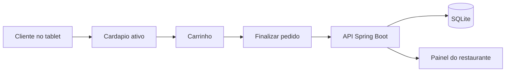
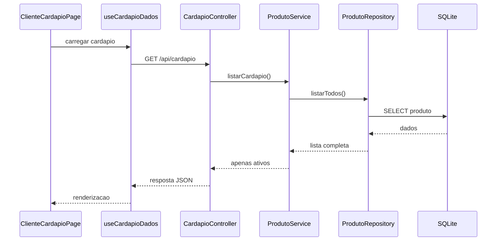
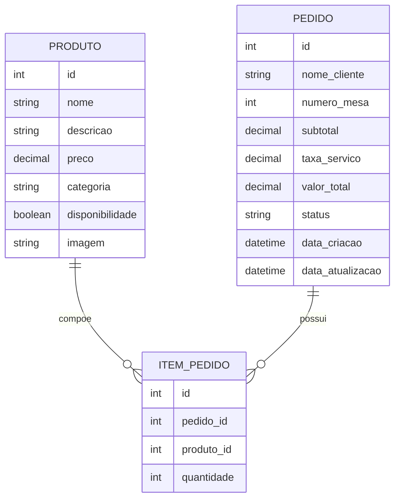
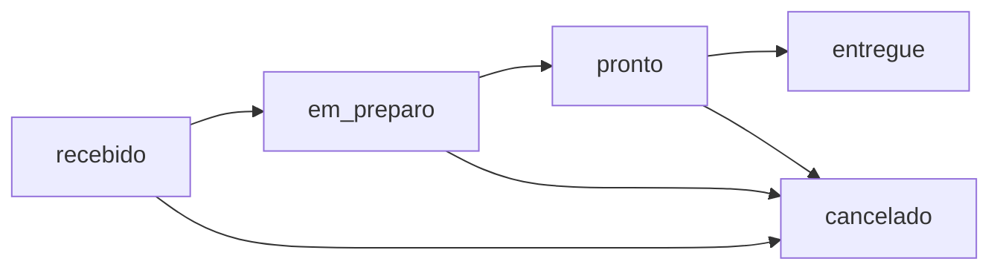

# Burguer Restaurant

## Visao geral do sistema

O **Burguer Restaurant** e uma aplicacao web de hamburgueria com dois contextos principais no mesmo projeto:

- o **modo cliente**, usado no tablet para montar e finalizar pedidos
- o **modo administrativo**, usado no computador do restaurante para gerenciar produtos e acompanhar pedidos

O objetivo do sistema e simples: o cliente faz o pedido na mesa, o pedido e salvo no banco de dados e aparece automaticamente no painel do restaurante.

---

## Stack utilizada

| Camada | Tecnologia | Papel no sistema |
|---|---|---|
| Front-end | React + Vite | interface do cliente e do admin |
| Back-end | Spring Boot | API REST e regras de negocio |
| Banco de dados | SQLite | persistencia relacional de produtos e pedidos |

Essa escolha atende ao trabalho porque usa:

- **Spring Boot** no back-end
- **React** no front-end
- **banco relacional** na persistencia

Tambem existe uma decisao importante de escopo: o projeto usa **um unico front-end React** com rotas separadas para cliente e administrador.  
Isso simplifica a apresentacao porque o mesmo sistema entrega as duas experiencias.

---

## Fluxo macro da aplicacao



O fluxo principal da aplicacao e esse:

1. o cliente abre o cardapio
2. adiciona itens ao carrinho
3. informa nome e mesa
4. finaliza o pedido
5. o backend persiste o pedido
6. o restaurante acompanha e atualiza o status no painel

Na pratica, isso cria uma linha bem clara de demonstracao:

- primeiro aparece o cardapio
- depois o carrinho
- depois a confirmacao do pedido
- por fim o painel administrativo recebendo e movendo esse pedido

---

## Arquitetura do back-end

O back-end foi mantido nas camadas minimas pedidas no enunciado.

| Camada | Responsabilidade |
|---|---|
| `controller` | recebe as requisicoes HTTP |
| `service` | concentra as regras de negocio |
| `repository` | faz o acesso ao SQLite |
| `dto` | define os contratos de entrada e saida da API |

Isso aplica um principio basico de engenharia de software: **separacao de responsabilidades**.  
Cada camada tem uma funcao clara, o que deixa o projeto mais facil de explicar, manter e evoluir.

---

## Estrutura principal do projeto

| Parte | Local |
|---|---|
| backend | `src/main/java` |
| migrations do banco | `src/main/resources/db/migration-sqlite` |
| frontend | `frontend/src` |
| documentacao | `docs` |

Os arquivos principais que representam a arquitetura sao:

- [src/main/java/com/burguer/restaurant/controller/CardapioController.java](/C:/Users/Eduardo/Documents/GitHub/Burguer-restaurant-Springboot/src/main/java/com/burguer/restaurant/controller/CardapioController.java)
- [src/main/java/com/burguer/restaurant/controller/PedidoController.java](/C:/Users/Eduardo/Documents/GitHub/Burguer-restaurant-Springboot/src/main/java/com/burguer/restaurant/controller/PedidoController.java)
- [src/main/java/com/burguer/restaurant/controller/ProdutoController.java](/C:/Users/Eduardo/Documents/GitHub/Burguer-restaurant-Springboot/src/main/java/com/burguer/restaurant/controller/ProdutoController.java)
- [src/main/java/com/burguer/restaurant/controller/AdminPedidoController.java](/C:/Users/Eduardo/Documents/GitHub/Burguer-restaurant-Springboot/src/main/java/com/burguer/restaurant/controller/AdminPedidoController.java)
- [src/main/java/com/burguer/restaurant/service/ProdutoService.java](/C:/Users/Eduardo/Documents/GitHub/Burguer-restaurant-Springboot/src/main/java/com/burguer/restaurant/service/ProdutoService.java)
- [src/main/java/com/burguer/restaurant/service/PedidoService.java](/C:/Users/Eduardo/Documents/GitHub/Burguer-restaurant-Springboot/src/main/java/com/burguer/restaurant/service/PedidoService.java)
- [src/main/java/com/burguer/restaurant/repository/ProdutoRepository.java](/C:/Users/Eduardo/Documents/GitHub/Burguer-restaurant-Springboot/src/main/java/com/burguer/restaurant/repository/ProdutoRepository.java)
- [src/main/java/com/burguer/restaurant/repository/PedidoRepository.java](/C:/Users/Eduardo/Documents/GitHub/Burguer-restaurant-Springboot/src/main/java/com/burguer/restaurant/repository/PedidoRepository.java)

No front-end, a entrada das telas fica organizada a partir das rotas:

- [frontend/src/rotas/router.tsx](/C:/Users/Eduardo/Documents/GitHub/Burguer-restaurant-Springboot/frontend/src/rotas/router.tsx)

Esse ponto e bom para mostrar que o sistema foi separado por contexto de uso, e nao por paginas misturadas.

---

## Abertura do sistema pelo modo cliente

A primeira experiencia do software acontece em:

- `http://localhost:5173/cliente`

Essa tela representa o tablet que fica com o cliente.  
Ela mostra o cardapio da hamburgueria por categorias, com imagem, nome, descricao e preco dos produtos.

Os arquivos mais importantes dessa parte sao:

- [frontend/src/paginas/ClienteCardapioPage.tsx](/C:/Users/Eduardo/Documents/GitHub/Burguer-restaurant-Springboot/frontend/src/paginas/ClienteCardapioPage.tsx)
- [frontend/src/hooks/produtoHooks.ts](/C:/Users/Eduardo/Documents/GitHub/Burguer-restaurant-Springboot/frontend/src/hooks/produtoHooks.ts)

Um trecho central dessa tela e:

```tsx
const { data, isLoading, isError, error, refetch, isFetching } = useCardapioDados();
```

Aqui a pagina usa um hook para buscar o cardapio na API.  
Essa decisao deixa a tela mais limpa porque a logica de acesso aos dados fica separada da renderizacao.

O hook que faz isso e bem direto:

```tsx
async function buscarCardapio(): Promise<CardapioProdutoDados[]> {
  const response = await api.get<CardapioProdutoDados[]>("/cardapio");
  return response.data;
}
```

Esse trecho e bom para explicar que o front-end nao acessa o banco nem escreve regra de negocio.  
Ele apenas consome a API REST e renderiza o resultado.

---

## Como o cardapio chega ao cliente



Arquivos envolvidos nesse fluxo:

- [src/main/java/com/burguer/restaurant/controller/CardapioController.java](/C:/Users/Eduardo/Documents/GitHub/Burguer-restaurant-Springboot/src/main/java/com/burguer/restaurant/controller/CardapioController.java)
- [src/main/java/com/burguer/restaurant/service/ProdutoService.java](/C:/Users/Eduardo/Documents/GitHub/Burguer-restaurant-Springboot/src/main/java/com/burguer/restaurant/service/ProdutoService.java)
- [src/main/java/com/burguer/restaurant/repository/ProdutoRepository.java](/C:/Users/Eduardo/Documents/GitHub/Burguer-restaurant-Springboot/src/main/java/com/burguer/restaurant/repository/ProdutoRepository.java)

No controller, a entrada desse fluxo fica assim:

```java
@GetMapping
public List<ProdutoDto.CardapioResposta> listarAtivos() {
    return produtoService.listarCardapio();
}
```

Esse trecho ajuda a mostrar uma caracteristica da arquitetura:  
o controller esta bem fino e delega a decisao real para o service.

Trecho de regra de negocio:

```java
public List<ProdutoDto.CardapioResposta> listarCardapio() {
    return produtoRepository.listarTodos()
            .stream()
            .filter(Produto::isDisponibilidade)
            .map(this::paraCardapioResposta)
            .toList();
}
```

Essa regra e importante porque separa claramente os dois contextos do sistema:

- o **cliente** ve apenas produtos ativos
- o **admin** pode ver todos os produtos cadastrados

Ou seja, o mesmo cadastro de produto serve para dois cenarios diferentes, mas com regras de exibicao diferentes.

---

## Carrinho e finalizacao do pedido

Depois de escolher os itens, o cliente monta o carrinho, informa o nome e o numero da mesa e finaliza o pedido.

Arquivos principais:

- [frontend/src/paginas/ClienteCardapioPage.tsx](/C:/Users/Eduardo/Documents/GitHub/Burguer-restaurant-Springboot/frontend/src/paginas/ClienteCardapioPage.tsx)
- [frontend/src/hooks/pedidoHooks.ts](/C:/Users/Eduardo/Documents/GitHub/Burguer-restaurant-Springboot/frontend/src/hooks/pedidoHooks.ts)
- [src/main/java/com/burguer/restaurant/controller/PedidoController.java](/C:/Users/Eduardo/Documents/GitHub/Burguer-restaurant-Springboot/src/main/java/com/burguer/restaurant/controller/PedidoController.java)
- [src/main/java/com/burguer/restaurant/service/PedidoService.java](/C:/Users/Eduardo/Documents/GitHub/Burguer-restaurant-Springboot/src/main/java/com/burguer/restaurant/service/PedidoService.java)

No front-end, quando o pedido da certo, o usuario e redirecionado para a tela de acompanhamento:

```tsx
pedidoCheckout.mutate(payload, {
  onSuccess: (pedidoCriado) => {
    navigate({
      to: "/cliente/pedido/$pedidoId",
      params: { pedidoId: String(pedidoCriado.id) },
    });
  },
});
```

No back-end, o pedido e montado e salvo:

```java
List<ItemPedido> itensPedido = montarItensPedido(requisicao);
Pedido pedido = criarPedidoInicial(requisicao, itensPedido);
return paraResposta(pedidoRepository.salvar(pedido));
```

O endpoint que recebe esse checkout e pequeno de proposito:

```java
@PostMapping("/checkout")
@ResponseStatus(HttpStatus.CREATED)
public PedidoDto.Resposta criarCheckout(@Valid @RequestBody PedidoDto.CheckoutRequisicao requisicao) {
    return pedidoService.criarCheckout(requisicao);
}
```

Esse desenho reforca a responsabilidade de cada camada:

- controller recebe a requisicao HTTP
- service valida, monta e calcula
- repository persiste
- dto define o contrato da entrada e da saida

Essa parte mostra outra ideia importante de engenharia de software:  
o **backend recalcula os valores do pedido**, em vez de confiar totalmente no que veio da interface.

Isso ajuda a manter a regra de negocio centralizada e mais segura.

Um trecho que mostra essa validacao e:

```java
Produto produto = produtoRepository.buscarPorId(requisicao.produtoId())
        .orElseThrow(() -> new NoSuchElementException("Produto nao encontrado para o id " + requisicao.produtoId()));

if (!produto.isDisponibilidade()) {
    throw new IllegalArgumentException("Produto indisponivel para pedido: " + produto.getNome());
}
```

Aqui aparecem duas protecoes importantes:

- o pedido so aceita produtos que realmente existem
- o pedido nao aceita produtos desativados, mesmo que a tela esteja aberta ha algum tempo

---

## Estrutura relacional do banco

O banco foi mantido simples para ficar facil de entender e atender ao escopo do trabalho.

Arquivo da migration:

- [src/main/resources/db/migration-sqlite/V1__estrutura_inicial.sql](/C:/Users/Eduardo/Documents/GitHub/Burguer-restaurant-Springboot/src/main/resources/db/migration-sqlite/V1__estrutura_inicial.sql)

Trecho inicial da migration:

```sql
PRAGMA foreign_keys = ON;

CREATE TABLE produto (
    id INTEGER PRIMARY KEY AUTOINCREMENT,
    nome TEXT NOT NULL,
    descricao TEXT NOT NULL,
    preco NUMERIC NOT NULL,
    categoria TEXT NOT NULL,
    disponibilidade INTEGER NOT NULL,
    imagem TEXT NULL
);
```

Essa migration e simples, mas ela mostra bem a ideia do projeto:

- primeiro habilita as chaves estrangeiras no SQLite
- depois cria as tabelas centrais do sistema
- por fim liga `item_pedido` com `pedido` e `produto`

Diagrama relacional:



As tres tabelas representam:

- `produto`: cardapio da hamburgueria
- `pedido`: cabecalho do pedido feito pelo cliente
- `item_pedido`: itens que pertencem a cada pedido

Vale destacar tambem o motivo de a migration estar em um unico arquivo:  
como o projeto foi enxugado para a apresentacao, a estrutura final do banco ficou consolidada em uma versao unica e facil de explicar.

---

## Tela de acompanhamento do pedido

Depois do checkout, o cliente acompanha o pedido em tempo real na tela de confirmacao.

Arquivo principal:

- [frontend/src/paginas/PedidoConfirmacaoPage.tsx](/C:/Users/Eduardo/Documents/GitHub/Burguer-restaurant-Springboot/frontend/src/paginas/PedidoConfirmacaoPage.tsx)

Hook usado:

- [frontend/src/hooks/pedidoHooks.ts](/C:/Users/Eduardo/Documents/GitHub/Burguer-restaurant-Springboot/frontend/src/hooks/pedidoHooks.ts)

Trecho importante:

```tsx
export function usePedidoDetalhe(id: number) {
  return useQuery({
    queryKey: queryKeys.pedido(id),
    queryFn: () => buscarPedido(id),
    enabled: Number.isFinite(id) && id > 0,
    retry: 2,
    refetchInterval: 5000,
  });
}
```

Esse `refetchInterval: 5000` faz a tela consultar a API a cada 5 segundos.  
Na pratica, isso significa que o cliente consegue ver o pedido sair de `recebido` para `em_preparo`, depois `pronto` e por fim `entregue`.

No backend, a consulta desse pedido fica exposta em uma rota bem objetiva:

```java
@GetMapping("/{id}")
public PedidoDto.Resposta buscarPorId(@PathVariable Long id) {
    return pedidoService.buscarPorId(id);
}
```

Isso ajuda a explicar que a tela de acompanhamento nao depende de estado local complexo.  
Ela apenas pergunta de novo para a API qual e o estado atual do pedido.

---

## Area administrativa de produtos

No contexto gerencial, o restaurante acessa:

- `http://localhost:5173/admin/produtos`

Essa pagina permite:

- cadastrar produtos
- editar produtos
- excluir produtos
- ativar ou desativar produtos

Arquivos principais:

- [frontend/src/paginas/ProdutosPage.tsx](/C:/Users/Eduardo/Documents/GitHub/Burguer-restaurant-Springboot/frontend/src/paginas/ProdutosPage.tsx)
- [frontend/src/componentes/FormularioProduto.tsx](/C:/Users/Eduardo/Documents/GitHub/Burguer-restaurant-Springboot/frontend/src/componentes/FormularioProduto.tsx)
- [src/main/java/com/burguer/restaurant/controller/ProdutoController.java](/C:/Users/Eduardo/Documents/GitHub/Burguer-restaurant-Springboot/src/main/java/com/burguer/restaurant/controller/ProdutoController.java)
- [src/main/java/com/burguer/restaurant/service/ProdutoService.java](/C:/Users/Eduardo/Documents/GitHub/Burguer-restaurant-Springboot/src/main/java/com/burguer/restaurant/service/ProdutoService.java)

Exemplo de endpoint de mudanca de status:

```java
@PatchMapping("/{id}/status")
public ProdutoDto.Resposta atualizarStatus(@PathVariable Long id,
        @Valid @RequestBody ProdutoDto.AtualizacaoStatus requisicao) {
    return produtoService.atualizarStatus(id, requisicao);
}
```

Essa funcionalidade atende um ponto central do enunciado: controlar o que fica visivel para o cliente sem perder o cadastro do produto.

Tambem existe uma regra importante de exclusao no service:

```java
try {
    produtoRepository.removerPorId(id);
} catch (DataIntegrityViolationException excecao) {
    throw new IllegalArgumentException("Nao e permitido excluir produto que ja faz parte de pedidos.");
}
```

Esse ponto e interessante para apresentar porque mostra preocupacao com integridade do historico.  
Se o produto ja participou de um pedido, o sistema evita apagar esse registro de forma inconsistente.

---

## Painel de pedidos do restaurante

O acompanhamento operacional acontece em:

- `http://localhost:5173/admin/pedidos`

Nessa tela, o restaurante visualiza:

- pedidos novos
- filtros por status
- mudanca de status
- exclusao de pedidos encerrados

Arquivos principais:

- [frontend/src/paginas/AdminPedidosPage.tsx](/C:/Users/Eduardo/Documents/GitHub/Burguer-restaurant-Springboot/frontend/src/paginas/AdminPedidosPage.tsx)
- [frontend/src/hooks/pedidoHooks.ts](/C:/Users/Eduardo/Documents/GitHub/Burguer-restaurant-Springboot/frontend/src/hooks/pedidoHooks.ts)
- [src/main/java/com/burguer/restaurant/controller/AdminPedidoController.java](/C:/Users/Eduardo/Documents/GitHub/Burguer-restaurant-Springboot/src/main/java/com/burguer/restaurant/controller/AdminPedidoController.java)
- [src/main/java/com/burguer/restaurant/service/PedidoService.java](/C:/Users/Eduardo/Documents/GitHub/Burguer-restaurant-Springboot/src/main/java/com/burguer/restaurant/service/PedidoService.java)

Trecho do hook administrativo:

```tsx
export function useAdminPedidos(status?: StatusPedido) {
  return useQuery({
    queryKey: queryKeys.adminPedidos(status),
    queryFn: () => buscarPedidos(status),
    retry: 2,
    refetchInterval: 5000,
  });
}
```

Aqui foi usada uma solucao simples e funcional para a v1: **polling automatico**.  
Em vez de WebSocket, o painel consulta a API periodicamente e se atualiza sozinho.

No controller administrativo, as operacoes principais ficam reunidas no mesmo contexto:

```java
@GetMapping
public List<PedidoDto.Resposta> listarTodos(@RequestParam(required = false) PedidoDto.Status status) {
    return pedidoService.listarTodos(status);
}

@DeleteMapping("/{id}")
@ResponseStatus(HttpStatus.NO_CONTENT)
public void remover(@PathVariable Long id) {
    pedidoService.remover(id);
}
```

Isso deixa o painel com um conjunto claro de acoes:

- listar pedidos
- filtrar por status
- alterar status
- remover pedidos encerrados

---

## Fluxo de status dos pedidos



Esse fluxo representa o ciclo do pedido dentro da hamburgueria:

- `recebido`: pedido acabou de entrar
- `em_preparo`: cozinha esta produzindo
- `pronto`: pedido pode ser entregue
- `entregue`: fluxo encerrado com sucesso
- `cancelado`: pedido interrompido antes do fim

Esse modelo e suficiente para demonstrar o processo operacional do restaurante sem adicionar complexidade desnecessaria.

Existe ainda uma regra de seguranca operacional no service:

```java
if (pedido.getStatus() != Pedido.Status.cancelado && pedido.getStatus() != Pedido.Status.entregue) {
    throw new IllegalArgumentException("So e permitido excluir pedidos cancelados ou entregues.");
}
```

Ou seja, o painel nao pode apagar um pedido que ainda esta em andamento.

---

## Requisitos do trabalho e como foram atendidos

| Requisito | Evidencia no sistema |
|---|---|
| cadastrar novos produtos | formulario na area admin e `POST /api/admin/produtos` |
| editar produtos | tela administrativa e `PATCH /api/admin/produtos/{id}` |
| excluir produtos | acao administrativa de exclusao |
| ativar ou desativar produtos | `PATCH /api/admin/produtos/{id}/status` |
| listar produtos | pagina `/admin/produtos` |
| visualizar pedidos | pagina `/admin/pedidos` |
| mostrar apenas produtos ativos ao cliente | endpoint `GET /api/cardapio` com filtro |
| adicionar ao carrinho | tela `/cliente` |
| finalizar compra | checkout com nome e numero da mesa |
| salvar compras no banco | tabelas `pedido` e `item_pedido` |
| usar API REST | comunicacao entre React e Spring Boot |
| manter camadas minimas | `controller`, `service`, `repository`, `dto` |
| interface responsiva | front adaptado para tablet e desktop |

Observacao:

- a **impressao de comanda** ficou fora da v1, e isso nao compromete a entrega porque o enunciado trata esse item como extra

---

## Visao final do software

O sistema completo pode ser entendido em dois blocos:

1. **cliente**
   faz o pedido no tablet e acompanha o status
2. **restaurante**
   gerencia o cardapio e opera os pedidos no painel

Essa organizacao resolve o problema principal do trabalho com um fluxo claro do inicio ao fim.

---

## Conclusao

O **Burguer Restaurant** entrega a proposta central do projeto:

- cardapio digital para o cliente
- painel operacional para o restaurante
- persistencia de pedidos em banco relacional
- separacao em camadas no back-end
- comunicacao via API REST entre front-end e back-end

Com isso, o software cobre o ciclo principal de uma hamburgueria de autoatendimento:  
o cliente pede, o sistema registra e o restaurante acompanha a execucao ate a entrega.
