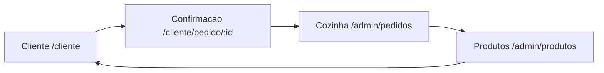
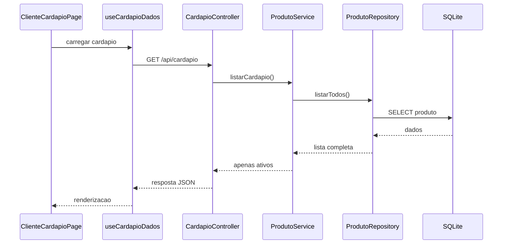
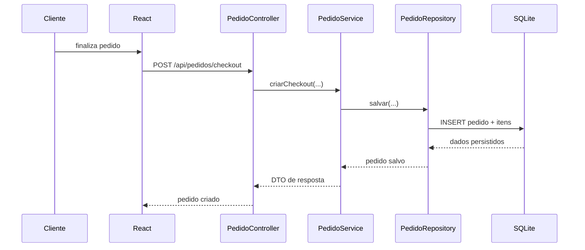
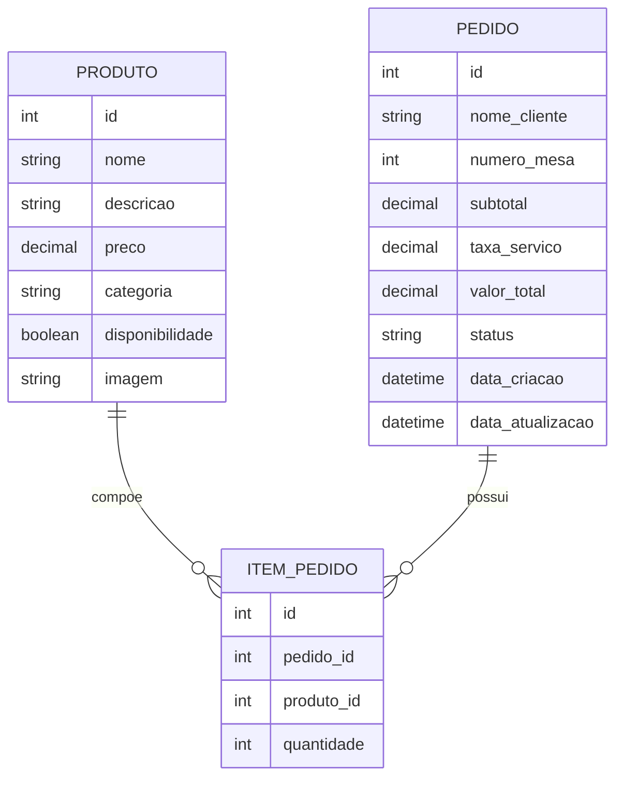
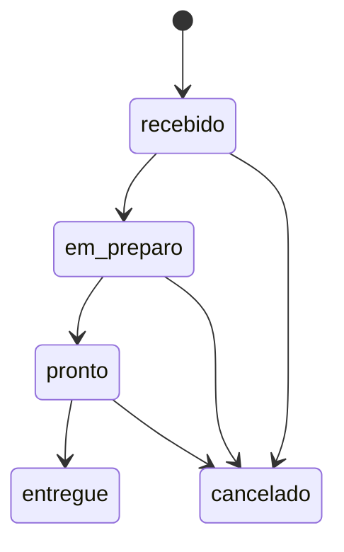
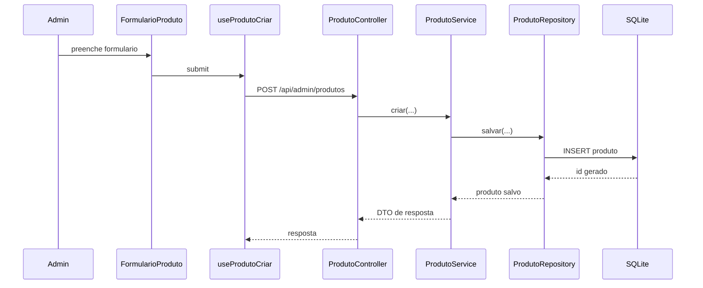

# Burguer Restaurant

## URLs principais

| Pagina | URL local |
|---|---|
| Cardapio do cliente | `http://localhost:5173/cliente` |
| Confirmacao do pedido | `http://localhost:5173/cliente/pedido/:id` |
| Painel de pedidos | `http://localhost:5173/admin/pedidos` |
| Gestao de produtos | `http://localhost:5173/admin/produtos` |
| API backend | `http://localhost:8080` |

## Visao geral da apresentacao

Esta apresentacao mostra o sistema da hamburgueria como um fluxo unico, saindo da tela do cliente, passando pelo codigo e chegando ate o banco de dados.

O caminho escolhido foi este:

1. overview de todas as telas
2. visao rapida das rotas
3. passagem breve pelos arquivos das paginas
4. retorno para a tela inicial do cliente
5. analise dos cards de produto
6. montagem do carrinho e explicacao da taxa de servico
7. envio do pedido e tela de confirmacao
8. ida para a tela administrativa da cozinha
9. caminho completo do pedido no codigo ate o banco
10. mudanca de status nas duas telas e reflexo no banco
11. area administrativa de produtos
12. criacao de novo produto e reflexo no cardapio
13. conclusao final

---

## Stack e recorte do projeto

| Camada | Tecnologia | Papel no sistema |
|---|---|---|
| Front-end | React + Vite | interface do cliente e do restaurante |
| Back-end | Spring Boot | API REST e regras de negocio |
| Banco de dados | SQLite | persistencia relacional de produtos e pedidos |
| Integracao com banco | Spring JDBC + SQLite JDBC Driver | acesso direto ao banco com SQL |
| Visualizacao de banco | DBeaver | inspecao das tabelas durante a apresentacao |

Na parte de persistencia, o projeto usa uma abordagem mais direta e didatica:

- **Spring JDBC** para executar consultas e comandos SQL
- **SQLite JDBC Driver** para conectar a aplicacao ao arquivo `.db`
- **Flyway** para criar e controlar a estrutura do banco

Isso significa que o projeto **nao usa JPA ou Hibernate**.  
Em vez disso, o acesso ao banco acontece com `JdbcTemplate`, deixando as queries visiveis dentro dos repositories.

Do ponto de vista de engenharia de software, o projeto foi mantido no formato mais simples pedido pelo trabalho:

| Camada | Responsabilidade |
|---|---|
| `controller` | recebe as requisicoes HTTP |
| `service` | concentra as regras de negocio |
| `repository` | acessa e persiste no banco |
| `dto` | define o contrato da API |

---

## Overview de todas as telas

Antes de entrar no codigo, vale mostrar rapidamente as quatro telas principais do sistema:

| Tela | Rota | Papel |
|---|---|---|
| Cardapio do cliente | `/cliente` | montar pedido no tablet |
| Confirmacao do pedido | `/cliente/pedido/:id` | acompanhar o pedido em andamento |
| Painel da cozinha | `/admin/pedidos` | operar os pedidos do restaurante |
| Gestao de produtos | `/admin/produtos` | cadastrar, editar, ativar e excluir produtos |



Esse panorama inicial ajuda o leitor a entender que o software tem dois contextos:

- **cliente**, focado em compra e acompanhamento
- **restaurante**, focado em operacao e cadastro

---

## Mapa das rotas

Depois do overview visual, o primeiro arquivo de codigo a abrir e:

- [frontend/src/rotas/router.tsx](/C:/Users/Eduardo/Documents/GitHub/Burguer-restaurant-Springboot/frontend/src/rotas/router.tsx)

Trecho principal:

```tsx
const clienteRoute = createRoute({
  getParentRoute: () => rootRoute,
  path: "/cliente",
  component: ClienteCardapioPage,
});

const pedidoConfirmacaoRoute = createRoute({
  getParentRoute: () => rootRoute,
  path: "/cliente/pedido/$pedidoId",
  component: PedidoConfirmacaoPage,
});

const adminProdutosRoute = createRoute({
  getParentRoute: () => rootRoute,
  path: "/admin/produtos",
  component: ProdutosPage,
});

const adminPedidosRoute = createRoute({
  getParentRoute: () => rootRoute,
  path: "/admin/pedidos",
  component: AdminPedidosPage,
});
```

Esse arquivo funciona como um mapa do sistema.  
Ele mostra rapidamente como as telas se ligam sem misturar o fluxo do cliente com o fluxo do restaurante.

---

## Passagem breve pelas paginas

Agora vale fazer uma leitura curta dos arquivos que representam cada tela:

- [frontend/src/paginas/ClienteCardapioPage.tsx](/C:/Users/Eduardo/Documents/GitHub/Burguer-restaurant-Springboot/frontend/src/paginas/ClienteCardapioPage.tsx)
- [frontend/src/paginas/PedidoConfirmacaoPage.tsx](/C:/Users/Eduardo/Documents/GitHub/Burguer-restaurant-Springboot/frontend/src/paginas/PedidoConfirmacaoPage.tsx)
- [frontend/src/paginas/AdminPedidosPage.tsx](/C:/Users/Eduardo/Documents/GitHub/Burguer-restaurant-Springboot/frontend/src/paginas/AdminPedidosPage.tsx)
- [frontend/src/paginas/ProdutosPage.tsx](/C:/Users/Eduardo/Documents/GitHub/Burguer-restaurant-Springboot/frontend/src/paginas/ProdutosPage.tsx)

| Arquivo | O que representa |
|---|---|
| `ClienteCardapioPage.tsx` | experiencia principal do tablet |
| `PedidoConfirmacaoPage.tsx` | acompanhamento do pedido pelo cliente |
| `AdminPedidosPage.tsx` | painel operacional da cozinha |
| `ProdutosPage.tsx` | catalogo administrativo |

Neste momento, a ideia ainda nao e aprofundar.  
O objetivo e apenas situar o leitor e mostrar que cada pagina tem um papel bem definido.

---

## Retorno para a tela inicial do cliente

Depois do panorama geral, a apresentacao volta para a tela inicial:

- `http://localhost:5173/cliente`

Essa tela e o ponto de entrada do sistema para quem esta sentado na mesa.

Arquivos centrais:

- [frontend/src/paginas/ClienteCardapioPage.tsx](/C:/Users/Eduardo/Documents/GitHub/Burguer-restaurant-Springboot/frontend/src/paginas/ClienteCardapioPage.tsx)
- [frontend/src/hooks/produtoHooks.ts](/C:/Users/Eduardo/Documents/GitHub/Burguer-restaurant-Springboot/frontend/src/hooks/produtoHooks.ts)

Trecho que carrega os dados:

```tsx
const { data, isLoading, isError, error, refetch, isFetching } = useCardapioDados();
```

Trecho do hook:

```tsx
async function buscarCardapio(): Promise<CardapioProdutoDados[]> {
  const response = await api.get<CardapioProdutoDados[]>("/cardapio");
  return response.data;
}
```

Esse momento e bom para explicar um conceito importante:

- a pagina renderiza
- o hook busca dados
- a API entrega o cardapio

Ou seja, o front-end nao acessa o banco diretamente.  
Ele conversa apenas com a API REST.

---

## Cards dos produtos na tela inicial

Com a tela inicial aberta, o foco passa para os cards dos produtos do cardapio.

Na pagina do cliente, cada produto e exibido dentro deste trecho:

```tsx
{grupo.itens.map((produto) => {
  const imagem = produto.imagem?.trim() ? produto.imagem : "/placeholder-produto.svg";

  return (
    <article key={produto.id} className="produto-cliente">
      

      <div className="produto-cliente__conteudo">
        <span className="produto-cliente__categoria">
          {formatarCategoria(produto.categoria)}
        </span>
        <h4>{produto.nome}</h4>
        <p>{produto.descricao}</p>

        <div className="produto-cliente__rodape">
          <strong>{formatarMoeda(produto.preco)}</strong>
          <button type="button" onClick={() => adicionarAoCarrinho(produto)}>
            Adicionar
          </button>
        </div>
      </div>
    </article>
  );
})}
```

Do ponto de vista visual, esse bloco representa o que o cliente realmente enxerga na mesa:

- imagem do produto
- categoria
- nome
- descricao
- preco
- botao para adicionar

Tambem vale mostrar que o cardapio e agrupado por categoria:

```tsx
function agruparCardapioPorCategoria(data?: CardapioProdutoDados[]): CategoriaAgrupada[] {
  if (!data) return [];

  const grupos = new Map<string, CardapioProdutoDados[]>();

  data.forEach((produto) => {
    const categoriaAtual = grupos.get(produto.categoria) ?? [];
    categoriaAtual.push(produto);
    grupos.set(produto.categoria, categoriaAtual);
  });

  return Array.from(grupos.entries()).map(([categoria, itens]) => ({
    categoria,
    itens,
  }));
}
```

Essa decisao melhora a navegacao no tablet e deixa o cardapio mais organizado.

---

## Como o cardapio chega ate os cards



Arquivos desse fluxo:

- [src/main/java/com/burguer/restaurant/controller/CardapioController.java](/C:/Users/Eduardo/Documents/GitHub/Burguer-restaurant-Springboot/src/main/java/com/burguer/restaurant/controller/CardapioController.java)
- [src/main/java/com/burguer/restaurant/service/ProdutoService.java](/C:/Users/Eduardo/Documents/GitHub/Burguer-restaurant-Springboot/src/main/java/com/burguer/restaurant/service/ProdutoService.java)
- [src/main/java/com/burguer/restaurant/repository/ProdutoRepository.java](/C:/Users/Eduardo/Documents/GitHub/Burguer-restaurant-Springboot/src/main/java/com/burguer/restaurant/repository/ProdutoRepository.java)

Trecho do controller:

```java
@GetMapping
public List<ProdutoDto.CardapioResposta> listarAtivos() {
    return produtoService.listarCardapio();
}
```

Trecho da regra de negocio:

```java
public List<ProdutoDto.CardapioResposta> listarCardapio() {
    return produtoRepository.listarTodos()
            .stream()
            .filter(Produto::isDisponibilidade)
            .map(this::paraCardapioResposta)
            .toList();
}
```

Esse filtro e um ponto importante de regra:

- o cliente ve somente produtos ativos
- o admin continua vendo todo o cadastro

---

## Adicionando produtos ao carrinho

Com os cards visiveis, a apresentacao passa a simular a montagem do pedido.

Trecho responsavel por adicionar itens:

```tsx
function adicionarAoCarrinho(produto: CardapioProdutoDados) {
  setCarrinho((itensAtuais) => {
    const itemExistente = itensAtuais.find((item) => item.id === produto.id);

    if (!itemExistente) {
      return [...itensAtuais, { ...produto, quantidade: 1 }];
    }

    return itensAtuais.map((item) =>
      item.id === produto.id ? { ...item, quantidade: item.quantidade + 1 } : item,
    );
  });
}
```

Depois, a quantidade pode ser alterada dentro do carrinho:

```tsx
function alterarQuantidade(produtoId: number, quantidade: number) {
  setCarrinho((itensAtuais) =>
    itensAtuais
      .map((item) => (item.id === produtoId ? { ...item, quantidade } : item))
      .filter((item) => item.quantidade > 0),
  );
}
```

Esse trecho mostra uma ideia simples, mas importante:

- a tela do cliente mantem um estado local do carrinho
- esse estado ainda nao e o pedido oficial
- o pedido oficial so existe depois do checkout

---

## Subtotal, taxa de servico e total

Com alguns produtos adicionados, o proximo passo e explicar os valores exibidos no carrinho.

Trecho do front-end:

```tsx
function calcularResumoCarrinho(carrinho: ItemCarrinho[]) {
  const subtotal = carrinho.reduce((acumulador, item) => acumulador + item.preco * item.quantidade, 0);
  const taxaServico = subtotal * 0.1;
  const valorTotal = subtotal + taxaServico;

  return { subtotal, taxaServico, valorTotal };
}
```

Trecho da area de resumo:

```tsx
<div className="resumo-pedido">
  <div>
    <span>Subtotal</span>
    <strong>{formatarMoeda(subtotal)}</strong>
  </div>
  <div>
    <span>Taxa de servico</span>
    <strong>{formatarMoeda(taxaServico)}</strong>
  </div>
  <div className="resumo-pedido__total">
    <span>Total</span>
    <strong>{formatarMoeda(valorTotal)}</strong>
  </div>
</div>
```

Aqui vale deixar clara a diferenca entre **previsao** e **valor oficial**:

| Camada | Papel no calculo |
|---|---|
| Front-end | mostrar uma previa amigavel para o cliente |
| Back-end | recalcular o valor oficial do pedido |
| Banco | persistir subtotal, taxa e total finais |

No backend, a taxa oficial e calculada dentro do modelo interno do pedido:

- [src/main/java/com/burguer/restaurant/repository/PedidoRepository.java](/C:/Users/Eduardo/Documents/GitHub/Burguer-restaurant-Springboot/src/main/java/com/burguer/restaurant/repository/PedidoRepository.java)

Trechos centrais:

```java
private static final BigDecimal TAXA_SERVICO = new BigDecimal("0.10");

public BigDecimal getSubtotal() {
    return itensPedido.stream()
            .map(ItemPedido::getSubtotal)
            .reduce(BigDecimal.ZERO, BigDecimal::add)
            .setScale(2, RoundingMode.HALF_UP);
}

public BigDecimal getTaxaServico() {
    return getSubtotal()
            .multiply(TAXA_SERVICO)
            .setScale(2, RoundingMode.HALF_UP);
}

public BigDecimal getValorTotal() {
    return getSubtotal()
            .add(getTaxaServico())
            .setScale(2, RoundingMode.HALF_UP);
}
```

Essa e uma boa hora para destacar um conceito de engenharia de software:

- regra critica de negocio deve ficar no backend

Assim, mesmo que o frontend mostre uma estimativa, o valor persistido continua confiavel.

---

## Finalizando o pedido

Depois de preencher nome e numero da mesa, o cliente finaliza o pedido.

Trecho que monta o payload:

```tsx
function montarPayloadCheckout(
  nomeCliente: string,
  numeroMesa: string,
  carrinho: ItemCarrinho[],
): PedidoCheckoutDados {
  return {
    nomeCliente: nomeCliente.trim(),
    numeroMesa: Number(numeroMesa),
    itens: carrinho.map((item) => ({
      produtoId: item.id,
      quantidade: item.quantidade,
    })),
  };
}
```

Trecho que envia:

```tsx
pedidoCheckout.mutate(payload, {
  onSuccess: (pedidoCriado) => {
    setCarrinho([]);
    setNomeCliente("");
    setNumeroMesa("");

    navigate({
      to: "/cliente/pedido/$pedidoId",
      params: { pedidoId: String(pedidoCriado.id) },
    });
  },
});
```

Aqui ja aparece uma transicao importante da apresentacao:

- antes, o cliente estava montando o carrinho
- agora, o sistema cria um pedido real e redireciona para o acompanhamento

---

## Tela de confirmacao e pedido em andamento

Depois do checkout, a tela muda para:

- `http://localhost:5173/cliente/pedido/:id`

Arquivo principal:

- [frontend/src/paginas/PedidoConfirmacaoPage.tsx](/C:/Users/Eduardo/Documents/GitHub/Burguer-restaurant-Springboot/frontend/src/paginas/PedidoConfirmacaoPage.tsx)

Trecho de busca:

```tsx
const { data, isLoading, isError, error, isFetching } = usePedidoDetalhe(Number(pedidoId));
```

Trecho visual do status:

```tsx
<span className={`status status--${data.status}`}>Status: {formatarStatus(data.status)}</span>
<h2>Pedido #{data.id}</h2>
<p>
  Mesa <strong>{data.numeroMesa}</strong> em nome de <strong>{data.nomeCliente}</strong>
</p>
```

Trecho do polling:

```tsx
export function usePedidoDetalhe(id: number) {
  return useQuery({
    queryKey: queryKeys.pedido(id),
    queryFn: () => buscarPedido(id),
    enabled: Number.isFinite(id) && id > 0,
    retry: 2,
    refetchInterval: 5000,
  });
}
```

Essa tela comunica uma ideia muito importante do sistema:

- o pedido foi enviado
- ele ainda esta em andamento
- o cliente consegue acompanhar a operacao sem dar refresh manual

---

## Indo para a tela administrativa da cozinha

Depois da confirmacao, a apresentacao vai direto para:

- `http://localhost:5173/admin/pedidos`

Arquivo principal:

- [frontend/src/paginas/AdminPedidosPage.tsx](/C:/Users/Eduardo/Documents/GitHub/Burguer-restaurant-Springboot/frontend/src/paginas/AdminPedidosPage.tsx)

Ali o restaurante visualiza:

- pedidos novos
- resumo operacional
- itens de cada pedido
- filtros por status
- botoes para avancar etapa ou cancelar

Trecho do carregamento:

```tsx
const { data, isLoading, isError, error, isFetching, refetch } = useAdminPedidos(
  filtroSelecionado === "todos" ? undefined : filtroSelecionado,
);
```

Trecho do polling:

```tsx
export function useAdminPedidos(status?: StatusPedido) {
  return useQuery({
    queryKey: queryKeys.adminPedidos(status),
    queryFn: () => buscarPedidos(status),
    retry: 2,
    refetchInterval: 5000,
  });
}
```

Esse momento liga diretamente as duas telas:

- o cliente acompanha o pedido
- a cozinha opera o mesmo pedido

---

## Como o pedido percorre o sistema ate o banco

Agora entra a parte mais importante do fluxo tecnico: o caminho completo do pedido.



Arquivos principais deste fluxo:

- [frontend/src/hooks/pedidoHooks.ts](/C:/Users/Eduardo/Documents/GitHub/Burguer-restaurant-Springboot/frontend/src/hooks/pedidoHooks.ts)
- [src/main/java/com/burguer/restaurant/controller/PedidoController.java](/C:/Users/Eduardo/Documents/GitHub/Burguer-restaurant-Springboot/src/main/java/com/burguer/restaurant/controller/PedidoController.java)
- [src/main/java/com/burguer/restaurant/service/PedidoService.java](/C:/Users/Eduardo/Documents/GitHub/Burguer-restaurant-Springboot/src/main/java/com/burguer/restaurant/service/PedidoService.java)
- [src/main/java/com/burguer/restaurant/repository/PedidoRepository.java](/C:/Users/Eduardo/Documents/GitHub/Burguer-restaurant-Springboot/src/main/java/com/burguer/restaurant/repository/PedidoRepository.java)

### 1. Front-end envia o checkout

```tsx
async function realizarCheckout(payload: PedidoCheckoutDados): Promise<PedidoDados> {
  const response = await api.post<PedidoDados>("/pedidos/checkout", payload);
  return response.data;
}
```

### 2. Controller recebe a requisicao

```java
@PostMapping("/checkout")
@ResponseStatus(HttpStatus.CREATED)
public PedidoDto.Resposta criarCheckout(@Valid @RequestBody PedidoDto.CheckoutRequisicao requisicao) {
    return pedidoService.criarCheckout(requisicao);
}
```

### 3. Service valida e cria o pedido

```java
@Transactional
public PedidoDto.Resposta criarCheckout(PedidoDto.CheckoutRequisicao requisicao) {
    List<ItemPedido> itensPedido = montarItensPedido(requisicao);
    Pedido pedido = criarPedidoInicial(requisicao, itensPedido);
    return paraResposta(pedidoRepository.salvar(pedido));
}
```

### 4. Validacao de produto existente e ativo

```java
Produto produto = produtoRepository.buscarPorId(requisicao.produtoId())
        .orElseThrow(() -> new NoSuchElementException("Produto nao encontrado para o id " + requisicao.produtoId()));

if (!produto.isDisponibilidade()) {
    throw new IllegalArgumentException("Produto indisponivel para pedido: " + produto.getNome());
}
```

### 5. Repository persiste o cabecalho e os itens

```java
private Pedido inserirPedido(Pedido pedido) {
    KeyHolder keyHolder = new GeneratedKeyHolder();
    jdbcTemplate.update(connection -> {
        PreparedStatement ps = connection.prepareStatement(SQL_INSERIR_PEDIDO, Statement.RETURN_GENERATED_KEYS);
        ps.setString(1, pedido.getNomeCliente());
        ps.setInt(2, pedido.getNumeroMesa());
        ps.setBigDecimal(3, pedido.getSubtotal());
        ps.setBigDecimal(4, pedido.getTaxaServico());
        ps.setBigDecimal(5, pedido.getValorTotal());
        ps.setString(6, pedido.getStatus().name());
        ps.setString(7, pedido.getDataCriacao().toString());
        ps.setString(8, pedido.getDataAtualizacao().toString());
        return ps;
    }, keyHolder);

    Long id = keyHolder.getKey().longValue();
    salvarItensPedido(id, pedido.getItensPedido());

    return new Pedido(id, pedido.getNomeCliente(), pedido.getNumeroMesa(), pedido.getItensPedido(),
            pedido.getStatus(), pedido.getDataCriacao(), pedido.getDataAtualizacao());
}
```

Esse trecho mostra bem a responsabilidade do repository:

- gravar o pedido
- recuperar o id gerado
- usar esse id para gravar os itens relacionados

---

## Como isso aparece no banco

Depois do envio do pedido, a proxima tela externa a mostrar e o banco no DBeaver.

Arquivo da migration:

- [src/main/resources/db/migration-sqlite/V1__estrutura_inicial.sql](/C:/Users/Eduardo/Documents/GitHub/Burguer-restaurant-Springboot/src/main/resources/db/migration-sqlite/V1__estrutura_inicial.sql)

Trecho da estrutura:

```sql
CREATE TABLE pedido (
    id INTEGER PRIMARY KEY AUTOINCREMENT,
    nome_cliente TEXT NOT NULL,
    numero_mesa INTEGER NOT NULL,
    subtotal NUMERIC NOT NULL,
    taxa_servico NUMERIC NOT NULL,
    valor_total NUMERIC NOT NULL,
    status TEXT NOT NULL,
    data_criacao TEXT NOT NULL,
    data_atualizacao TEXT NOT NULL
);

CREATE TABLE item_pedido (
    id INTEGER PRIMARY KEY AUTOINCREMENT,
    pedido_id INTEGER NOT NULL,
    produto_id INTEGER NOT NULL,
    quantidade INTEGER NOT NULL,
    CONSTRAINT fk_item_pedido_pedido FOREIGN KEY (pedido_id) REFERENCES pedido (id),
    CONSTRAINT fk_item_pedido_produto FOREIGN KEY (produto_id) REFERENCES produto (id)
);
```

Explicacao curta da migration:

- `produto` guarda o cardapio
- `pedido` guarda o cabecalho do pedido
- `item_pedido` relaciona pedido e produto



Aqui o DBeaver ajuda a mostrar visualmente:

- o pedido entrando em `pedido`
- os itens entrando em `item_pedido`
- os valores subtotal, taxa e total ja calculados

---

## Alterando status nas duas telas

Depois de o pedido existir no banco e na cozinha, a apresentacao passa a mostrar o ciclo operacional:

- cliente acompanha em `/cliente/pedido/:id`
- cozinha altera em `/admin/pedidos`
- banco reflete a mudanca em `pedido.status`



Trecho do botao administrativo:

```tsx
const statusSeguinte = proximoStatus(pedido.status);

<button
  type="button"
  disabled={!statusSeguinte || atualizarStatus.isPending || removerPedido.isPending}
  onClick={() => statusSeguinte && alterarStatus(pedido.id, statusSeguinte)}
>
  {tituloAcaoStatus(pedido.status)}
</button>
```

Trecho do hook:

```tsx
async function atualizarStatusPedido(id: number, status: StatusPedido) {
  const response = await api.patch(`/admin/pedidos/${id}/status`, {
    status,
  });

  return response.data;
}
```

Trecho do controller administrativo:

```java
@PatchMapping("/{id}/status")
public PedidoDto.Resposta atualizarStatus(@PathVariable Long id,
        @Valid @RequestBody PedidoDto.AtualizacaoStatusRequisicao requisicao) {
    return pedidoService.atualizarStatus(id, requisicao);
}
```

Trecho do service:

```java
@Transactional
public PedidoDto.Resposta atualizarStatus(Long id, PedidoDto.AtualizacaoStatusRequisicao requisicao) {
    Pedido pedido = buscarPedido(id).comStatus(Pedido.Status.valueOf(requisicao.status().name()), OffsetDateTime.now());
    return paraResposta(pedidoRepository.salvar(pedido));
}
```

E entao vale voltar para o DBeaver e mostrar:

- o campo `status` mudando
- `data_atualizacao` sendo atualizada

Esse e um dos melhores momentos da apresentacao porque conecta:

- interface do cliente
- interface da cozinha
- regra no backend
- persistencia no banco

---

## Pagina administrativa de produtos

Depois de encerrar o fluxo do pedido, a apresentacao muda de assunto e entra no catalogo administrativo:

- `http://localhost:5173/admin/produtos`

Arquivo principal:

- [frontend/src/paginas/ProdutosPage.tsx](/C:/Users/Eduardo/Documents/GitHub/Burguer-restaurant-Springboot/frontend/src/paginas/ProdutosPage.tsx)

Essa tela permite:

- listar produtos
- abrir formulario de novo produto
- editar
- ativar e desativar
- excluir

Trecho da listagem:

```tsx
<section className="grade-produtos">
  {data?.map((produto) => (
    <CartaoProduto key={produto.id ?? `${produto.nome}-${produto.preco}`} produto={produto} />
  ))}
</section>
```

Aqui vale mostrar tambem o componente do card administrativo:

- [frontend/src/componentes/CartaoProduto.tsx](/C:/Users/Eduardo/Documents/GitHub/Burguer-restaurant-Springboot/frontend/src/componentes/CartaoProduto.tsx)

Trecho do card:

```tsx
<label className="cartao-produto__checkbox">
  <input
    type="checkbox"
    checked={produto.disponibilidade}
    onChange={(e) => alternarDisponibilidade(e.target.checked)}
  />
  Visivel no cliente
</label>
```

Esse ponto ajuda a explicar novamente a regra de exibicao:

- produto pode existir no admin
- mas nao necessariamente aparecer para o cliente

---

## Como os produtos aparecem no banco

Depois de mostrar a listagem administrativa, o proximo passo e abrir a tabela `produto` no DBeaver.

Trecho da migration:

```sql
CREATE TABLE produto (
    id INTEGER PRIMARY KEY AUTOINCREMENT,
    nome TEXT NOT NULL,
    descricao TEXT NOT NULL,
    preco NUMERIC NOT NULL,
    categoria TEXT NOT NULL,
    disponibilidade INTEGER NOT NULL,
    imagem TEXT NULL
);
```

Campos mais importantes para comentar:

| Campo | Uso |
|---|---|
| `nome` | nome comercial do item |
| `descricao` | explicacao curta do produto |
| `preco` | valor unitario |
| `categoria` | agrupamento no cardapio |
| `disponibilidade` | controla exibicao ao cliente |
| `imagem` | URL da imagem |

Esse trecho e simples, mas muito didatico para apresentacao porque mostra exatamente o que o formulario pede.

---

## Criando um novo produto

Agora a apresentacao simula a criacao de um produto novo.

Arquivo do formulario:

- [frontend/src/componentes/FormularioProduto.tsx](/C:/Users/Eduardo/Documents/GitHub/Burguer-restaurant-Springboot/frontend/src/componentes/FormularioProduto.tsx)

Trecho do envio:

```tsx
const produto: ProdutoDados = {
  nome: nome.trim(),
  descricao: descricao.trim(),
  preco: Number(preco),
  categoria,
  imagem: imagem.trim(),
  disponibilidade,
};
```

Trecho que diferencia criar e editar:

```tsx
if (initial?.id) {
  atualizar(
    { id: initial.id, produto },
    {
      onSuccess: () => {
        limparFormulario();
        onSuccess?.();
      },
    },
  );
  return;
}

criar(produto, {
  onSuccess: () => {
    limparFormulario();
    onSuccess?.();
  },
});
```

No proprio formulario, os campos pedidos ficam bem visiveis:

- nome
- descricao
- preco
- categoria
- URL da imagem
- disponibilidade

Isso atende diretamente ao enunciado do trabalho.

---

## Caminho do novo produto no codigo

Depois de preencher e salvar, vale mostrar o fluxo tecnico do cadastro:



Trecho do hook:

```tsx
async function criarProduto(produto: ProdutoDados) {
  const response = await api.post("/admin/produtos", produto);
  return response.data;
}
```

Trecho do repository:

```java
private Produto inserirProduto(Produto produto) {
    KeyHolder keyHolder = new GeneratedKeyHolder();
    jdbcTemplate.update(connection -> {
        PreparedStatement ps = connection.prepareStatement(SQL_INSERIR_PRODUTO, Statement.RETURN_GENERATED_KEYS);
        ps.setString(1, produto.getNome());
        ps.setString(2, produto.getDescricao());
        ps.setBigDecimal(3, produto.getPreco());
        ps.setString(4, produto.getCategoria().name());
        ps.setInt(5, produto.isDisponibilidade() ? 1 : 0);
        ps.setString(6, produto.getImagem());
        return ps;
    }, keyHolder);

    Long id = keyHolder.getKey().longValue();
    return new Produto(id, produto.getNome(), produto.getDescricao(), produto.getPreco(), produto.getCategoria(),
            produto.isDisponibilidade(), produto.getImagem());
}
```

Depois disso, vale abrir de novo o DBeaver para mostrar o novo registro na tabela `produto`.

---

## Voltando para a tela inicial para provar que o produto apareceu

Com o produto salvo e ativo, a apresentacao retorna para:

- `/cliente`

Isso permite mostrar na pratica que:

- o produto existe no banco
- o produto existe no admin
- o produto aparece no cardapio do cliente

Se o checkbox de disponibilidade estiver marcado, ele entra no fluxo do cliente.  
Se estiver desmarcado, ele continua cadastrado, mas fica oculto do cardapio publico.

Essa parte fecha muito bem o ciclo de produto ponta a ponta.

---

## Pontos finais que valem comentar

Antes de concluir, ainda valem algumas observacoes tecnicas curtas:

| Tema | Observacao |
|---|---|
| Polling | foi escolhido por simplicidade para a v1 |
| Taxa de servico | mostrada no front, mas validada no backend |
| Banco | uso de SQLite atende ao requisito de banco relacional |
| Status do pedido | fluxo simples e suficiente para uma hamburgueria |
| Impressao de comanda | ficou fora da v1 por ser item extra |

Tambem vale lembrar que a arquitetura do projeto ficou propositalmente enxuta para facilitar:

- leitura
- manutencao
- demonstracao em sala

---

## Conclusao

O **Burguer Restaurant** entrega o ciclo principal do trabalho:

- o cliente monta um pedido no tablet
- o sistema calcula e registra esse pedido
- a cozinha acompanha e altera o status
- o cliente visualiza o andamento em tempo real
- os produtos podem ser gerenciados pelo admin
- tudo fica persistido em banco relacional

Com isso, a apresentacao consegue mostrar o sistema de ponta a ponta, sempre conectando:

- **tela**
- **codigo**
- **regra de negocio**
- **banco de dados**
