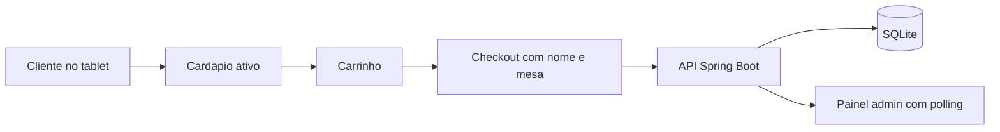

# Burguer Restaurant

Sistema de hamburgueria com:

- `Spring Boot` no backend
- `React + Vite` no frontend
- `SQLite` como banco relacional oficial

O projeto foi organizado para o trabalho final com dois modos no mesmo frontend:

- `/cliente`: tablet de autoatendimento
- `/admin/produtos` e `/admin/pedidos`: painel do restaurante

## O que a v1 entrega

- cardapio exibindo apenas produtos ativos
- carrinho no tablet do cliente
- checkout com `nomeCliente` e `numeroMesa`
- persistencia de pedidos no `SQLite`
- painel administrativo de pedidos com polling automatico de `5s`
- gestao administrativa de produtos com ativacao e desativacao

## Stack

- Java 21
- Spring Boot
- Maven Wrapper
- SQLite
- Flyway
- React
- Vite
- TypeScript
- TanStack Query
- TanStack Router

## Estrutura

- `src/main/java`: backend
- `src/main/resources/db/migration-sqlite`: migrations SQL
- `src/test/java`: testes do backend
- `frontend`: app React
- `frontend/src/test`: testes de frontend
- `docs`: documentacao do projeto

## Pre-requisitos

- Java 21
- Node.js 20+

## Como rodar

### Opcao 1 - script pronto

No PowerShell:

```powershell
.\run-with-env.ps1
```

No bash/WSL:

```bash
chmod +x run-with-env.sh
./run-with-env.sh
```

Esse fluxo sobe:

- frontend Vite em `http://localhost:5173`
- backend Spring Boot em `http://localhost:8080`

### Opcao 2 - subir manualmente

Backend:

```powershell
.\mvnw.cmd spring-boot:run "-Dmaven.repo.local=.mvn\repository"
```

Frontend:

```powershell
cd frontend
npm install
npm run dev
```

## Rotas do frontend

- `http://localhost:5173/cliente`
- `http://localhost:5173/admin/produtos`
- `http://localhost:5173/admin/pedidos`

## Modo simples por rota

O frontend aceita um modo opcional via variavel de ambiente:

- `VITE_MODO_APP=livre`: mostra menu e libera todas as telas
- `VITE_MODO_APP=cliente`: libera apenas `/cliente` e `/cliente/pedido/:id`
- `VITE_MODO_APP=admin`: libera apenas `/admin/produtos` e `/admin/pedidos`

Quando o modo e `cliente` ou `admin`, o menu superior de navegacao fica escondido.

## Tutorial de rede local

Objetivo:

- PC do restaurante hospedando backend + frontend admin
- tablet ou outro PC da rede acessando apenas o frontend cliente

### 1. Descobrir o IP da maquina servidora

No PowerShell da maquina que vai hospedar o sistema:

```powershell
ipconfig
```

Anote o `IPv4`, por exemplo `192.168.0.15`.

### 2. Subir o backend na maquina servidora

Use `cmd` para evitar problema de parametro do Maven no PowerShell:

```powershell
cmd /c ".\mvnw.cmd -Dmaven.test.skip=true spring-boot:run"
```

O backend ficara em:

- `http://localhost:8080`

### 3. Subir o frontend administrativo na maquina servidora

Em outro terminal:

```powershell
cd frontend
$env:VITE_MODO_APP="admin"
npm run dev -- --host 0.0.0.0 --port 5173
```

Esse frontend fica para a cozinha ou para o computador do restaurante:

- `http://localhost:5173/admin/produtos`
- `http://localhost:5173/admin/pedidos`

### 4. Subir o frontend do cliente na maquina servidora

Em mais um terminal:

```powershell
cd frontend
$env:VITE_MODO_APP="cliente"
npm run dev -- --host 0.0.0.0 --port 5174
```

Esse frontend fica para o tablet ou outro PC da rede.

### 5. Acessar pelo tablet ou outro PC

No dispositivo cliente, abrir:

```text
http://IP_DA_MAQUINA_SERVIDORA:5174/cliente
```

Exemplo:

```text
http://192.168.0.15:5174/cliente
```

### 6. O que abrir em cada maquina

| Maquina | URL |
|---|---|
| servidor - produtos | `http://localhost:5173/admin/produtos` |
| servidor - pedidos | `http://localhost:5173/admin/pedidos` |
| tablet ou outro PC | `http://IP_DA_MAQUINA_SERVIDORA:5174/cliente` |

### 7. Se outro dispositivo nao conseguir entrar

Verifique:

- se as duas maquinas estao na mesma rede
- se o firewall do Windows liberou as portas `5173`, `5174` e `8080`
- se o backend esta rodando na maquina servidora
- se o IP usado no tablet e o IPv4 correto da maquina servidora

### 8. Voltar para o modo normal de desenvolvimento

Se quiser navegar livremente no frontend durante desenvolvimento:

```powershell
cd frontend
Remove-Item Env:VITE_MODO_APP -ErrorAction SilentlyContinue
npm run dev
```

## Endpoints principais

### Cliente

- `GET /api/cardapio`
- `POST /api/pedidos/checkout`
- `GET /api/pedidos/{id}`

### Admin

- `GET /api/admin/produtos`
- `POST /api/admin/produtos`
- `PATCH /api/admin/produtos/{id}`
- `PATCH /api/admin/produtos/{id}/status`
- `DELETE /api/admin/produtos/{id}`
- `GET /api/admin/pedidos`
- `PATCH /api/admin/pedidos/{id}/status`

## Banco de dados

- banco oficial: `SQLite`
- arquivo local: `data/restaurant-app.db`
- migration unica atual: `src/main/resources/db/migration-sqlite/V1__estrutura_inicial.sql`

Nao usamos mais `Docker` nem `MySQL` neste repositorio.

### Recriar a base local

Como as migrations foram consolidadas em uma versao unica, a base local antiga precisa ser recriada para ficar alinhada com o estado atual do projeto.

Passos:

```powershell
Remove-Item .\data\restaurant-app.db -ErrorAction SilentlyContinue
.\run-with-env.ps1
```

## Testes

Backend:

```powershell
.\mvnw.cmd test "-Dmaven.repo.local=.mvn\repository"
```

Frontend:

```powershell
cd frontend
npm test
npm run build
```

## Fluxo funcional resumido



## Referencias do trabalho

- `docs/PROJETO.md`: arquitetura, backlog resumido e criterio de aceite
- `docs/CONTEXTO_PROJETO.md`: contexto operacional atual
- `TODO.md`: backlog atualizado
