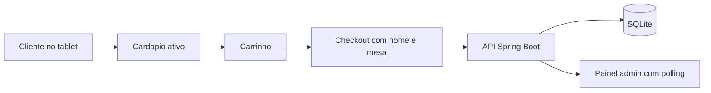

# Burguer Restaurant

Sistema de hamburgueria com:

- `Spring Boot` no backend
- `React + Vite` no frontend
- `SQLite` como banco relacional oficial

O projeto foi organizado para o trabalho final com dois modos no mesmo frontend:

- `/cliente`: tablet de autoatendimento
- `/admin/produtos` e `/admin/pedidos`: painel do restaurante

## O que a v1 entrega

- cardapio exibindo apenas produtos ativos
- carrinho no tablet do cliente
- checkout com `nomeCliente` e `numeroMesa`
- persistencia de pedidos no `SQLite`
- painel administrativo de pedidos com polling automatico de `5s`
- gestao administrativa de produtos com ativacao e desativacao

## Stack

- Java 21
- Spring Boot
- Maven Wrapper
- SQLite
- Flyway
- React
- Vite
- TypeScript
- TanStack Query
- TanStack Router

## Estrutura

- `src/main/java`: backend
- `src/main/resources/db/migration-sqlite`: migrations SQL
- `src/test/java`: testes do backend
- `frontend`: app React
- `frontend/src/test`: testes de frontend
- `docs`: documentacao do projeto

## Pre-requisitos

- Java 21
- Node.js 20+

## Como rodar

### Opcao 1 - script pronto

No PowerShell:

```powershell
.\run-with-env.ps1
```

No bash/WSL:

```bash
chmod +x run-with-env.sh
./run-with-env.sh
```

Esse fluxo sobe:

- frontend Vite em `http://localhost:5173`
- backend Spring Boot em `http://localhost:8080`

### Opcao 2 - subir manualmente

Backend:

```powershell
.\mvnw.cmd spring-boot:run "-Dmaven.repo.local=.mvn\repository"
```

Frontend:

```powershell
cd frontend
npm install
npm run dev
```

## Rotas do frontend

- `http://localhost:5173/cliente`
- `http://localhost:5173/admin/produtos`
- `http://localhost:5173/admin/pedidos`

## Endpoints principais

### Cliente

- `GET /api/cardapio`
- `POST /api/pedidos/checkout`
- `GET /api/pedidos/{id}`

### Admin

- `GET /api/admin/produtos`
- `POST /api/admin/produtos`
- `PATCH /api/admin/produtos/{id}`
- `PATCH /api/admin/produtos/{id}/status`
- `DELETE /api/admin/produtos/{id}`
- `GET /api/admin/pedidos`
- `PATCH /api/admin/pedidos/{id}/status`

## Banco de dados

- banco oficial: `SQLite`
- arquivo local: `data/restaurant.db`
- migrations: `src/main/resources/db/migration-sqlite`

Nao usamos mais `Docker` nem `MySQL` neste repositorio.

## Testes

Backend:

```powershell
.\mvnw.cmd test "-Dmaven.repo.local=.mvn\repository"
```

Frontend:

```powershell
cd frontend
npm test
npm run build
```

## Fluxo funcional resumido



## Referencias do trabalho

- `docs/PROJETO.md`: arquitetura, backlog resumido e criterio de aceite
- `docs/CONTEXTO_PROJETO.md`: contexto operacional atual
- `TODO.md`: backlog atualizado
